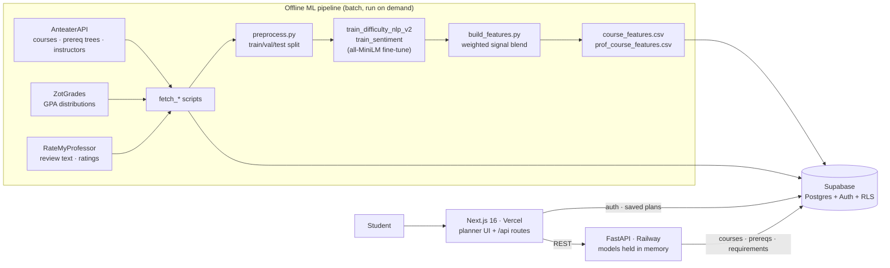

# PlanUCI

**ML-powered academic planner that generates optimized multi-quarter course schedules for UCI students.**

[](https://www.python.org/)
[](https://www.typescriptlang.org/)
[](https://fastapi.tiangolo.com/)
[](https://nextjs.org/)
[](https://supabase.com/)
[](https://pytorch.org/)

**Live demo:** https://plan-uci-three.vercel.app

<!-- SCREENSHOT PLACEHOLDER: planner grid with a generated 4-year schedule, difficulty bars per quarter -->


---

## The problem

Planning a degree at UCI means holding four disconnected sources in your head at once: the catalogue (what your major requires), the prerequisite tree (what unlocks what), ZotGrades (which sections actually curve), and RateMyProfessor (who can teach). Students reconcile these by hand in a spreadsheet, and the failure mode is expensive — you discover in your third year that a required course only runs in Fall, its prereq chain is three quarters deep, and you have just added a quarter to your degree.

PlanUCI collapses that into one pass: pick a major and a graduation target, and get a quarter-by-quarter schedule that is prerequisite-valid, unit-legal, and deliberately smoothed so you are not carrying three of the hardest courses in the catalogue at once.

## Features

- **ML difficulty scoring** — per-course and per-(course, professor) difficulty on a 1–10 scale, blending course-description NLP, historical GPA distributions, and RateMyProfessor signals.
- **Constraint-based multi-quarter optimizer** — seeds a prerequisite-valid plan, then hill-climbs it against eight soft objectives while never breaking a hard constraint.
- **Professor comparison** — ranks instructors per course from historical grade distributions and RateMyProfessor ratings. (The review-text sentiment classifier is trained and served but **not yet wired into this** — see [Known limitations](#known-limitations).)
- **Drag-and-drop planner** — pin the courses you have already committed to; the rebalancer honors locks and reflows everything else around them.
- **PDF export** — the finished plan as a shareable one-pager.

## Architecture



The ML pipeline is **offline and batch**. Nothing trains at request time: `build_features.py` writes two CSVs, `scripts/load_features.py` pushes them into Supabase, and the FastAPI process loads both fine-tuned encoders into memory once at startup (`backend/app/main.py:43`) and keeps them there for the life of the server.

---

## ML pipeline

Everything below is reproducible from the scripts in `ml/`.

### Data

| Source | Table | Rows | Used for |
|---|---|---:|---|
| AnteaterAPI | `courses` | 7,771 | descriptions, units, terms offered, prereq trees |
| AnteaterAPI | `instructors` | 3,281 | name → ucinetid resolution |
| AnteaterAPI | `prereq_edges` | 4,781 | prerequisite DAG |
| AnteaterAPI + scrape | `major_requirements` | 2,856 | 158 major/specialization requirement sets |
| ZotGrades | `grade_distributions` | 55,880 | per-section A–F counts → GPA |
| RateMyProfessor | `rmp_reviews` | 1,481 | review text, difficulty/overall ratings — **verified 1:1 matches only** |
| joined | `course_instructors` | 27,049 | (course, professor) pairs scored |

> `rmp_reviews` used to hold 3,264 rows. It now holds 1,481, and that reduction is the point — see [Instructor→RMP matching](#instructorrmp-matching-precision-over-recall).

### The headline result: a course difficulty tier classifier

`ml/scripts/train_difficulty_nlp_v2.py` → **test macro F1 0.576** on 252 held-out courses.

A fine-tuned **`all-MiniLM-L6-v2`** with a linear head. Input `"{title}: {description}"` → a 3-way tier (easy / medium / hard). The label is derived from each course's historical GPA: min-max scaled to a 1–10 score, then cut at the **training set's** 20th/80th percentiles (`ml/data/preprocess.py:33-45`). Cutoffs come from train only and are applied unchanged to val and test; the split asserts zero course-ID overlap (`ml/data/preprocess.py:60-66`).

**The interesting part is that v1 failed.** The first version was a regression head trained on MSE, and it collapsed — it predicted "medium" for essentially every course, scoring **macro F1 0.248 with easy-F1 and hard-F1 of exactly 0.0** (`ml/evals/difficulty_nlp_v1_metrics.json`). The diagnosis: UCI GPAs cluster far too tightly for a uniform 1–10 regression target to separate anything. Reframing the task as percentile-cut 3-class classification with cross-entropy, and oversampling the tails to fix the ~60%-medium imbalance, is what made the model work at all.

| | v1 (MSE regression) | v2 (percentile-cut classification) |
|---|---:|---:|
| macro F1 | 0.248 | **0.576** |
| easy F1 | 0.000 | 0.585 |
| medium F1 | 0.743 | 0.697 |
| hard F1 | 0.000 | 0.447 |
| accuracy | — | 0.627 |

Hard-tier F1 (0.447) is the weakest cell and always will be from text alone — a course description cannot tell you that a professor curves brutally. That is precisely why the scoring heuristic below folds in GPA and RMP.

> Test set is 252 courses and the hard tier is ~18% of it, so per-tier F1 has a wide confidence interval. Produced by `ml/evals/eval_difficulty.py` → `ml/evals/results/nlp_eval.json`.

### Professor sentiment classifier

`ml/models/train_sentiment.py` → **test macro F1 0.522** on 60 held-out RMP records.

A second fine-tuned `all-MiniLM-L6-v2`. Input is a professor's concatenated RateMyProfessor review text → one of four actionable labels: `teaches_well`, `easy_grade`, `harsh_grader`, `avoid`. Labels come from **weak supervision** — deterministic rules over the numeric ratings (`assign_label`, `train_sentiment.py:49-67`), with a fixed priority order resolving multi-matches.

This number used to read 0.809. It was inflated by leakage, and the fix is worth stating plainly: instructor→RMP name matching maps many distinct `ucinetid`s onto the **same** RMP record, duplicating one review blob (and its label) across up to 80 rows. Of 1,291 labeled rows only **591 texts were distinct**, and a stratified row-level split put **56% of the test set's exact text into train** — the model was scoring by memorization. The split now de-duplicates on `review_text` and asserts no text crosses a split boundary. **0.522 is the honest number.**

| | leaked | corrected |
|---|---:|---:|
| test macro F1 | 0.809 | **0.522** |
| test records | 130 | 60 |

Per-class test F1: `avoid` 0.813 · `easy_grade` 0.706 · `teaches_well` 0.370 · `harsh_grader` 0.200. At 60 test records these are noisy, and `harsh_grader` rests on 8 examples.

### The difficulty scoring heuristic (not a model)

`ml/models/fit_signal_weights.py` → `ml/models/signal_weights.json`

Three signals per (course, professor) pair, each normalized to 1–10, combined into one score:

- `nlp_score` — softmax over the tier classifier, mapped `easy→2, medium→5.5, hard→9`
- `gpa_score` — the instructor's weighted GPA for that course, inverted
- `rmp_score` — RMP difficulty rating, rescaled from 1–5

| signal | weight |
|---|---:|
| `nlp_score` | 0.358 |
| `gpa_score` | 0.291 |
| `rmp_score` | 0.465 |

**The three signals are rank-normalized to a common 1–10 distribution before the weights are applied.** Raw, they are not comparable: `nlp_score` and `rmp_score` both centre near 5.6, but `gpa_score = (4 − gpa)/3 × 10` is crushed into the bottom of its nominal range (mean **1.9**), because UCI GPAs cluster near 3.4. Weights are only meaningful across signals that share a scale.

**Missing signals are handled in two steps.** First the absent signal's weight is dropped and the rest renormalized. That alone is *not* scale-preserving — each signal is rank-normalized over the rows where it is present, and those populations differ — so a second **missingness calibration** is applied: on the rows that carry all three signals, we measure what each missingness pattern would score versus the full 3-signal blend, and subtract that offset. A 2-signal row is then an unbiased estimate of what the 3-signal blend would have said (`build_features.py`, "Missingness calibration"):

| pattern | rows | offset |
|---|---:|---:|
| nlp + gpa + rmp | 4,621 | +0.0000 |
| nlp + rmp | 11,730 | −0.1013 |
| nlp + gpa | 2,022 | −0.3492 |
| nlp only | 8,676 | −0.8659 |

Without this, a course whose professors happened to lack a clean RateMyProfessor match scored **0.67 points easier** on the 1–10 scale — an artifact of name-matching luck, affecting ~a third of the catalogue. The build now prints the residual shift for every pattern and it is 0.0000 by construction.

Separately, courses with a description but **no `course_instructors` rows at all** never enter the instructor-level blend, so they fall back to the NLP score directly, keeping the whole catalogue covered (`build_features.py`, "NLP-only fallback for instructorless courses").

### Confidence: which scores are worth trusting

Calibration makes a low-data score **unbiased**. It does not make it **precise** — a course scored from the description alone rests entirely on a classifier with a held-out macro F1 of 0.576, and carries far more variance than one corroborated by grade history and professor ratings. Nothing in the product used to say so, and a guess looked exactly as authoritative as a measurement.

Every score now carries a `confidence` keyed directly on which signals backed it — deliberately **not** a probabilistic confidence, since there is no calibrated basis for one:

| tier | signals | courses | share |
|---|---|---:|---:|
| `high` | nlp + gpa + rmp | 2,319 | 29.8% |
| `medium` | two of the three | 2,797 | 36.0% |
| `low` | NLP text only | **2,655** | **34.2%** |

It is served through `/api/course-difficulties` and rendered on the course card as a small badge — `FULL DATA` / `PARTIAL DATA` / `LOW DATA`, with the reason on hover. **Low-confidence scores are still shown, never hidden or blanked**: the number plus an honest caveat beats silently withholding it. `signals_present` is emitted alongside so any score is auditable back to its inputs.

**No accuracy is claimed for this blend, deliberately.** The weights were originally derived by a Ridge regression, and that regression was circular: the target it fit against is itself built from these same three signals using these same weights, so a closed-form weighted mean reconstructs it with MAE ~2e-8 (r = 1.0). There was nothing to learn and nothing to measure. The weights are best understood as a **documented prior** — stable and defensible, but unvalidated, because no exogenous ground truth for course difficulty exists here yet. Ridge over OLS still holds on its own terms (the signals are correlated; L2 keeps coefficients from swinging), but a reasonable weighting is not a validated model. See [Known limitations](#known-limitations) and `DECISIONS.md`.

### Instructor→RMP matching: precision over recall

`backend/scripts/fetch_rmp.py`

The original matcher had no name check at all. It fired an instructor's name at RateMyProfessor's relevance search, scraped every `legacyId` off the results page, took the first three, and kept **whichever had the most ratings**. RMP's search matches on any token — including a bare middle initial — so `"Michael A Carroll"` returns the professor literally named `'A' Pantano` (Mathematics, 58 ratings), who wins on popularity. Every UCI instructor with middle initial "A" was assigned her ratings: **80 of them**.

The damage, measured before the fix:

| | |
|---|---:|
| instructors with an RMP rating | 3,231 |
| distinct RMP records behind them | 1,487 |
| **instructors sharing a rating with someone else** | **2,276 (70.4%)** |
| feature rows with a poisoned `rmp_score` | 18,483 (68.7%) |

The matcher now requires **exact first-and-last name agreement** after normalization (middle initials and suffixes stripped; an RMP record whose first name is a bare initial is rejected outright), uses **department to disambiguate** genuine namesakes — there really are two Michael Greens — and enforces **one RMP record → at most one instructor**, dropping *both* claimants when contested rather than guessing. Every drop is logged with a reason.

| | before | after |
|---|---:|---:|
| instructors with an `rmp_score` | 3,264 | **1,481** |
| contested RMP records | 1,487 collisions | **0** |
| rows with a poisoned `rmp_score` | 18,483 | **0** |

**Coverage fell from 98% to 45%, and that is the correct trade.** A missing signal has a calibrated fallback; a wrong one silently poisons every difficulty score in the product. The invariant is now enforced in Postgres, not by a script that only runs when someone remembers to run it:

```sql
CREATE UNIQUE INDEX rmp_reviews_rmp_id_unique
  ON public.rmp_reviews (rmp_id) WHERE rmp_id IS NOT NULL;
```

`rmp_id`, `rmp_first_name`, `rmp_last_name` and `rmp_department` are now persisted, so any match can be audited without re-scraping. 1,800 drops are logged with reasons (`backend/scripts/rmp_dropped.log`).

**Blast radius.** Mean absolute change in served course difficulty: **1.799** on the 1–10 scale; **66.4% of courses moved more than 1 point**, 18.2% moved more than 3. A second bug surfaced while fixing this one: RateMyProfessor reports `avgDifficulty == 0` to mean *"no ratings on record,"* but the old code fed that through its linear rescale and produced `rmp_score = −1.25` — off the bottom of the scale. **EECS160B was ranked the easiest course in the entire catalogue** on the strength of that single sentinel value. It now scores 9.78.

### Three-level aggregation

Scores roll up through three granularities, each consumed by a different part of the product:

```
(course, professor)  →  difficulty per pair                    27,049 rows
                        signals rank-normalized to a common
                        scale, blended by the frozen weights,
                        weights renormalized + a per-pattern
                        offset applied when a signal is missing
                        build_features.py :: combined_score,
                                            "Missingness calibration"
        │  weighted by sections_taught
        ▼
course               →  difficulty per course                   7,771 rows
                        percentile rank-normalized across the
                        whole catalogue → 1–10
                                          build_features.py:327-366
        │  decaying weights; the hardest course dominates
        ▼
quarter              →  quarter difficulty
                        weights [1.0, .85, .72, .61, .52, .44],
                        + count penalty (n−3)×0.3, clamped to 10
                                        soft_constraints.py:117-146
```

The quarter-level formula is deliberately **not** a plain mean. A quarter with one brutal course and three easy ones *feels* hard, so the hardest course carries the most weight and overloading is penalized on top.

---

## Schedule optimizer

`backend/scripts/optimizer/`

**Prerequisite DAG.** 4,781 `prereq_edges` rows collapse to a graph of **2,978 nodes / 4,525 edges**, verified acyclic (`backend/scripts/validate_prereq_dag.py`). Prereq trees are boolean expressions — `AND` / `OR` / `NOT`, plus AP-exam leaves and corequisite flags — evaluated by `_eval_tree` in `hard_constraints.py`, not flat edge lists, so "ICS 33 **or** placement exam" resolves correctly.

**Seed.** `_asap_schedule` (`plan_generator.py:1029`) places each course in the earliest quarter its prerequisites allow, subject to the unit cap and historical term availability — a Fall-only course never lands in Winter. Corequisites are pulled into their partner's quarter.

**Search.** `optimize` (`optimizer.py:165`) runs stochastic hill-climbing: pick a random course, move it to a random other quarter, keep the move only if it survives every hard constraint *and* lowers the soft penalty. `generate` runs this from 5 perturbed seeds and returns the best 3 variants.

**Hard constraints** — violate any one and the plan is rejected:

- prerequisites satisfied in every quarter
- per-quarter unit cap
- graduation quarter, with dynamic extension up to 16 quarters before raising `FeasibilityError`
- **GE deadline** — no *unlocked* GE may land in Year 3+ (`GE_LAST_QUARTER_IDX = 5`). A GE whose own prereqs are unschedulable within Years 1–2 is exempt.
- corequisites share a quarter
- no duplicate courses

**Soft constraints** — eight weighted penalties, lower is better (`soft_constraints.py:28-53`):

| scorer | weight | penalizes |
|---|---:|---|
| `lower_div_earliness` | 0.60 | lower-division courses scheduled late |
| `over_cap_penalty` | 0.50 | quarters above the unit cap |
| `difficulty_balance` | 0.40 | variance in per-quarter difficulty |
| `adjacent_smoothing` | 0.40 | swings > 1.5 between consecutive quarters (flat +0.5 above 2.0) |
| `min_units_load` | 0.30 | non-empty quarters under 12 units |
| `ge_distribution` | 0.20 | more than 2 GEs in one quarter |
| `workload_progression` | 0.20 | flat or *decreasing* difficulty over time |
| `major_clustering` | 0.20 | same-department courses spread more than 2 quarters apart |

**Lock-aware rebalance.** `whatif.optimize_around_locks` treats user-pinned courses as immovable, validates that the locks are mutually satisfiable, and reflows only the unlocked remainder.

**Performance and scaling.** The optimizer sits behind a two-tier cache — an in-process L1 in front of a Supabase L2. A warm cache hit returns in ~11 ms against ~5 s for a cold solve, roughly **470× faster**, measured on a local instance — a cache-hit-vs-cold-solve latency figure, *not* a Railway/Supabase throughput claim. Under concurrent load (Locust), warm hits sustain ~**20×** the throughput of cold solves at equal concurrency, and cold-solve throughput saturates at **~6 req/s** on a single process, degrading gracefully — rising latency, no failures — past the knee at ~50 concurrent users. Profiling under load flagged per-request disk I/O as a real cost: memoizing a ~7,700-row reference table that had been re-parsed on every call lifted sustained throughput ~20% (5.1 → 6.1 req/s at 50 users) with byte-for-byte identical output. Methodology, the runbook, and the raw CSVs live in `backend/loadtest/`.

---

## Tech stack

| Layer | Technology |
|---|---|
| **Frontend** | Next.js 16 (App Router), React 19, TypeScript 5, Tailwind 4, `@dnd-kit` (drag & drop), `jspdf` (export) |
| **API** | Next.js route handlers (BFF) → FastAPI (Python 3.13), Pydantic v2, Uvicorn |
| **ML** | PyTorch 2.12, sentence-transformers 5.5 (`all-MiniLM-L6-v2`), scikit-learn 1.8 (Ridge), pandas, rapidfuzz (instructor name matching) |
| **Optimizer** | NetworkX (DAG validation), custom hill-climber |
| **Data** | Supabase (Postgres + Auth + Row Level Security), CSV feature artifacts |
| **Deploy** | Vercel (frontend), Railway via Dockerfile (backend), Supabase (managed) |

---

## Local setup

**Prerequisites:** Python 3.13+, Node 20+, a Supabase project, and **[Git LFS](https://git-lfs.com)**.

```bash
git lfs install                                          # required — see below
git clone https://github.com/RyanTMcDaniel/PlanUCI.git
cd PlanUCI
```

> **Git LFS is not optional.** The three fine-tuned model checkpoints (~87 MB each) are stored in LFS. Clone without it and `ml/models/*/model.safetensors` arrive as 133-byte pointer files rather than weights, and the backend dies at startup when `SentenceTransformer` tries to load them. If you have already cloned without LFS, run `git lfs install && git lfs pull`. Verify with `git lfs ls-files` — it should list three `model.safetensors`.

### 1. Database

Run `supabase_setup.sql` in the Supabase SQL editor. It creates `course_features`, `prof_course_features`, `user_profiles`, `saved_degree_plans`, `app_stats`, and the RLS policies. The course / instructor / grade tables are populated by the fetch scripts in `backend/scripts/`.

### 2. Backend

Create `backend/.env`:

```bash
SUPABASE_URL=https://<project>.supabase.co
SUPABASE_SERVICE_KEY=<service-role-key>   # bypasses RLS — server only, never ship to the client
ANTEATER_API_KEY=<key>                    # only needed to re-run the fetch scripts
```

```bash
cd backend
python3 -m venv venv
source venv/bin/activate
pip install -r requirements.txt
uvicorn app.main:app --reload --port 8001
```

Models load at startup (~10s on CPU). Verify with `curl localhost:8001/health` → `{"status":"ok","models_loaded":true}`. Interactive docs at `localhost:8001/docs`.

### 3. Frontend

Create `frontend/.env.local`:

```bash
NEXT_PUBLIC_SUPABASE_URL=https://<project>.supabase.co
NEXT_PUBLIC_SUPABASE_ANON_KEY=<anon-key>
SUPABASE_SERVICE_KEY=<service-role-key>
OPTIMIZER_BACKEND_URL=http://localhost:8001
```

```bash
cd frontend
npm install
npm run dev          # http://localhost:3000
```

### 4. Tests

```bash
cd backend && venv/bin/python3 -m pytest tests/ -v    # 22 tests
```

> The suite talks to a live Supabase instance — `backend/.env` must be populated for it to run.

### Rebuilding the ML artifacts (optional)

```bash
backend/venv/bin/python3 -m ml.data.preprocess               # train/val/test split
backend/venv/bin/python3 -m ml.scripts.train_difficulty_nlp_v2
backend/venv/bin/python3 -m ml.models.train_sentiment        # writes sentiment_v1/model_card.json
backend/venv/bin/python3 -m ml.models.fit_signal_weights     # writes signal_weights.json
backend/venv/bin/python3 -m ml.data.build_features           # writes the two feature CSVs
backend/venv/bin/python3 -m ml.evals.eval_difficulty         # writes ml/evals/results/nlp_eval.json
backend/venv/bin/python3 -m ml.scripts.serialize_models      # smoke-tests both models, writes registry.json
backend/venv/bin/python3 scripts/load_features.py            # push CSVs → Supabase
```

> **Ordering caveat:** `build_features.py:26` reads `signal_weights.json` to construct the very target that `fit_signal_weights.py` fits. The two are mutually dependent, which is exactly why no accuracy is claimed for the blend — see [Known limitations](#known-limitations).

---

## Repo structure

```
backend/
  app/                     FastAPI service — main.py loads models at startup
    routers/               /difficulty, /sentiment, /optimizer endpoints
  scripts/
    optimizer/             seed generator, hill-climber, hard + soft constraints, what-if, cache
    fetch_*.py             AnteaterAPI / ZotGrades / RMP ingestion
    validate_prereq_dag.py DAG acyclicity check
  tests/                   22 pytest tests (require live Supabase)
frontend/
  app/planner/             the planner UI (PlannerClient.tsx)
  app/api/                 route handlers proxying to FastAPI + Supabase
  lib/                     Supabase clients, PDF export
ml/
  data/                    fetch → preprocess → build_features; feature CSVs + splits
  models/                  fine-tuned encoders, classifier heads, signal weights, registry
  evals/                   standalone eval scripts + committed metrics
  scripts/                 training entrypoints
scripts/load_features.py   CSV → Supabase loader
supabase_setup.sql         schema + RLS policies
DECISIONS.md               running engineering log
```

### API surface

| Method | Endpoint | Purpose |
|---|---|---|
| `GET` | `/health` | liveness + model-load check |
| `POST` | `/difficulty/course` | course-level difficulty score |
| `POST` | `/difficulty/professor` | per-professor score with signal breakdown |
| `POST` | `/sentiment/professor` | sentiment label + confidence |
| `POST` | `/optimizer/generate` | generate schedule variants for a major |
| `POST` | `/optimizer/whatif` | re-optimize around locks |
| `POST` | `/optimizer/swap`, `/optimizer/move` | single-course edits, revalidated |
| `POST` | `/optimizer/requirements_state` | outstanding requirement decisions |
| `POST` | `/optimizer/validate_locks` | are the user's pins mutually satisfiable |
| `POST` | `/optimizer/propose_prereqs`, `/apply_prereqs` | surface + inject missing prereq chains |

---

## Known limitations

Stated plainly, because these are the things I would ask about first.

**The scoring heuristic has no exogenous label, so it cannot be validated.** `difficulty_score` is built *from* the three signals the blend consumes (`build_features.py`, `combined_score`), using the very weights `fit_signal_weights.py` produces — a closed-form weighted mean reconstructs it to ~2e-8. Any error metric against that target measures internal consistency and nothing else, so none is reported. This is why the blend is described as a prior rather than a model. The real fix is a genuinely independent label — student-reported difficulty collected by survey, or next-term GPA held out in time — and re-deriving the weights against that.

**The sentiment classifier is deliberately not wired into the product.** It is trained and serialized (`train_sentiment.py`, `ml/models/sentiment_v1/`) and served at `POST /sentiment/professor`, but nothing calls that endpoint and `rmp_reviews.sentiment_label` is `NULL` for all 1,481 matched professors. This is a decision, not an oversight.

The model is trained on 591 records (472 train) across 4 classes and reaches a held-out macro F1 of **0.522**. The original 0.809 was inflated by leakage: instructor→RMP name matching mapped many `ucinetid`s onto the same RateMyProfessor record, so the identical review text — and the identical weak label, which is a pure function of that professor's aggregate ratings — appeared across up to 80 rows. Only 591 of 1,291 labeled texts were distinct, and a stratified row-level split put 56% of the test set's exact text into train, letting the model score by memorizing strings it had already seen. Rows are now de-duplicated on `review_text` before splitting, and no text may appear in more than one split.

Its output would be a per-professor verdict — `avoid`, `harsh_grader` — attached to a named individual and shown to students choosing whose section to take. At 0.522 macro F1 over 4 classes, that is too weak a model for an output that consequential. A missing signal is recoverable and has a documented fallback; a wrong, named judgment about a real person is not.

What would change the decision: substantially more review data; collapsing the target from 4 classes to a binary; or reframing the output as a course-level aggregate signal rather than a verdict about a named professor. Any of the three makes the model's error rate survivable. None of them is true today.

**The RMP precision fix degraded the professor-comparison features, not just difficulty.** `/api/top-professors`, `/api/professor` and `/api/course-stats` all read `rmp_reviews`. Instructor coverage there fell from ~99% to **45.1%** (63.1% of course-instructor pairs), so `avg_difficulty` / `avg_quality` now render null for most professors. That is the intended trade — a wrong rating is worse than a missing one — but the UI does not yet distinguish "no data" from "average," and the recall work below is what buys the coverage back.

**A third of the catalogue is now scored by the NLP classifier alone.** Tightening the RMP match to 45% coverage means 8,676 of 27,049 feature rows (32%) have only `nlp_score` — so their difficulty rests entirely on a text classifier with a held-out macro F1 of 0.576. The missingness calibration makes those rows *unbiased* in expectation, but unbiased is not the same as *precise*: they carry more variance than a 3-signal row, and nothing in the pipeline currently communicates that uncertainty to the user. A per-row confidence, driven by which signals are present, is the obvious next step.

**RMP recall is the flip side of the precision fix.** 1,741 instructors were dropped for `no_full_name_match` — some genuinely aren't on RateMyProfessor, but others are there under a nickname ("Mike" vs "Michael"), a maiden name, or a differently-spelled surname. A safe recall pass (nickname table, or high-threshold fuzzy match on the surname *plus* mandatory department agreement) could recover a meaningful share without reopening the collision.

**`match_professors.py` is now dead and dangerous.** It fuzzy-matches on `WRatio >= 88` and *reassigns* `rmp_reviews.ucinetid`, which would happily undo the verified 1:1 mapping the new scraper produces. It is no longer called by anything and should be deleted.

**The difficulty classifier's test set is small.** 252 courses, with the hard tier at ~18% of it — roughly 46 examples behind `hard` F1 = 0.447. There are no confidence intervals and no seed-variance runs anywhere in the repo, so treat 0.576 as directional.

**The sentiment model is weakly supervised, and its test set is smaller still.** Labels are deterministic rules over RMP numeric ratings, so the model's ceiling is "recover a 4-branch rule from text." Its actual value is labeling professors whose numeric ratings are missing — and nothing in the repo yet measures coverage on exactly that population. 60 test records; `harsh_grader` F1 rests on 8.

**The hill-climber has never been benchmarked against its own seed.** `optimize()` returns an `improved` boolean but no measurement of *how much* better than the ASAP seed it is, and `iterations_run` is hardcoded to `max_iter` (`optimizer.py:287`) rather than counting real iterations. Until there is a "mean soft score: seed X → optimized Y across N majors" number, the search is unproven.

**The hill-climb loop deepcopies the whole plan on every iteration.** Profiling under concurrent load shows this per-iteration object copying — together with a Supabase client constructed per `evaluate()` / `optimize()` call — is the dominant remaining throughput ceiling after the disk-I/O fix above. It is a known cost, not yet addressed; the harness in `backend/loadtest/` is the baseline a future fix would be measured against.

**The cold-path Supabase reads have no retry or connection pooling.** Each cold solve opens a fresh client and issues its reference-data reads directly; under load one request in ~440 (**0.23%**) surfaced as a transient HTTP 500 from a single failed read. This points at the same un-pooled per-call-client path as the item above — a retry or a shared pooled client would absorb it.

**Seed generation can emit multiple late GEs the hill-climber cannot unwind.** Single-course moves cannot escape a local optimum where several GEs are jointly stranded past the Year-2 deadline: each individual corrective move is rejected because it breaks another constraint. A swap neighborhood or an explicit repair operator would help.

**Community difficulty ratings are not blended in.** All three current signals are proxies. Real student-reported per-course difficulty is the missing fourth signal, and adding it would also break the circular-target problem above.

**No CI.** The 22 tests pass locally but require live Supabase credentials, so they cannot run in a GitHub Action as written. The pure-logic core (`_eval_tree`, the soft scorers, `_asap_schedule`) should be separated from the Supabase-dependent integration tests and gated on every push.

## Roadmap

- Fix instructor→RMP name matching so distinct instructors stop sharing one RMP record
- Independent difficulty labels (student survey) → re-derive the blend against a real target
- Seed/optimizer benchmark harness with published before/after soft scores
- Split pure-logic tests from Supabase integration tests; add GitHub Actions
- Humanities majors (STEM + Business requirement sets are currently the most complete)
- Schedule-conflict awareness (meeting times, not just quarters)

---

## License

MIT
